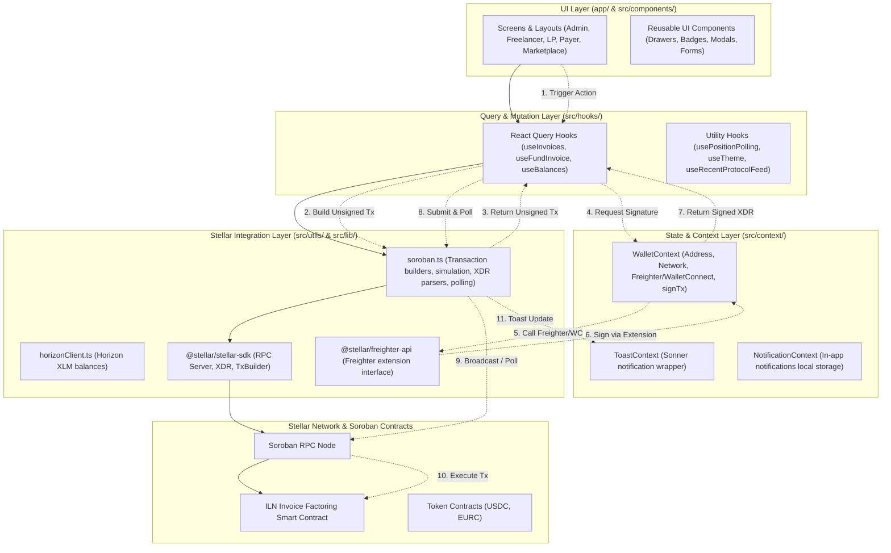

# Frontend Architecture Overview

This document describes the design decisions, folder structure, data flow patterns, and architectural trade-offs of the Invoice Liquidity Network (ILN) frontend. It serves as a guide for new contributors to understand the codebase structure and development conventions.

---

## 🎨 System Architecture Diagram

The frontend is structured in clear architectural layers. Reading data from the Stellar network flows synchronously down through React Query, while writing transactions involves coordination between custom mutation hooks, the wallet context (external extension), and the Soroban RPC.



---

## 📁 Directory Structure & Conventions

ILN utilizes a Next.js App Router workspace with source code separated between page routing (`app/`) and core logic/reusable components (`src/`).

```
├── app/                        # Next.js App Router root (Layouts & Pages)
│   ├── admin/                  # Admin portal (parameters, contract governance)
│   ├── analytics/              # Cash flow & volume charts
│   ├── api/                    # API endpoints (reminders, feedback)
│   ├── freelancer/             # Freelancer dashboard & invoice submission
│   ├── governance/             # Voting portal
│   ├── lp/                     # Liquidity Provider portfolio dashboard
│   ├── marketplace/            # Open invoices explorer
│   ├── payer/                  # Payer dashboard & email reminders opt-in
│   ├── profile/                # User settings & reputation profiles
│   ├── submit/                 # Submitter checkout & confirmation flows
│   └── Providers.tsx           # Providers (React Query, Toasts, MSW)
│
├── src/                        # Core codebase
│   ├── components/             # Presentational UI components (Bells, Drawers, etc.)
│   ├── context/                # Global React Contexts (Wallet, Toasts, Notifications)
│   ├── hooks/                  # Custom React Hooks & query definitions
│   │   └── queries/            # React Query keys configuration and types
│   ├── lib/                    # Services layer (Stellar SDK, Supabase client, Horizon)
│   └── utils/                  # General helpers and Soroban RPC callers
│       └── soroban.ts          # Core Stellar/Soroban bridge code
│
├── styles/                     # Tailwind CSS v4 stylesheets
│   └── globals.css             # Main styling entry (The Fiscal Atelier config)
```

### Conventions

- **Client Components**: File routes and sub-components that use React state, contexts, or custom hooks must include `"use client"` at the top.
- **Component Placement**: Routing, layout structure, and page-specific shell components live inside `app/`. Reusable, stateless, or presentation-only components belong in `src/components/` and should be accompanied by Storybook stories (`.stories.tsx`).
- **Separation of Concerns**: UI components should never invoke `@stellar/stellar-sdk` or `rpc.Server` directly. All blockchain transactions, parsing of ScVals, and simulations are abstractly handled in `src/utils/soroban.ts` or custom hooks.

---

## 🔄 Data Flow (Contract ➔ Hooks ➔ Components)

Data flow is divided cleanly into **Read Operations** and **Write Transactions**.

### 1. Read Operations (Reactive & Cached)

Reads are non-blocking, simulated via the Soroban RPC, and cached by TanStack React Query.

1. A **UI Component** calls a custom hook (e.g., `useInvoices()`).
2. The **Custom Hook** uses `useQuery` mapped to a specific query key (e.g., `invoiceKeys.all`).
3. The query function invokes a utility function from `src/utils/soroban.ts` (e.g., `getAllInvoices()`).
4. **`soroban.ts`** uses `@stellar/stellar-sdk` to simulate a contract read invocation on the RPC server using a dummy account `READ_ACCOUNT`.
5. The JSON-RPC response is received, converted from XDR/ScVal structures into standard TypeScript interfaces (e.g., `Invoice`), and cached.
6. The UI Component receives the clean TypeScript array and renders it.

### 2. Write Transactions (Interactive Lifecycle)

Writes require user approval via a wallet browser extension.

1. The user clicks a button (e.g., "Fund Invoice") triggering a mutation method returned by `useFundInvoice()`.
2. The mutation function starts a **pending toast** to alert the user.
3. The mutation calls the contract-building utility (e.g., `fundInvoice()`) inside `soroban.ts`, simulating the transaction to calculate appropriate resource fees.
4. The simulation result is assembled into an unsigned transaction `Transaction` object.
5. The mutation requests a signature from the connected wallet by calling `signTx` from `WalletContext`.
6. The user signs the transaction in their Freighter/WalletConnect extension.
7. The signed XDR string is returned to the mutation hook.
8. The mutation hook submits the signed transaction via `submitSignedTransaction()`. This broadcasts the transaction to the network and polls the Soroban RPC server status until it resolves in a ledger block.
9. On success, the toast updates from "pending" to "success," and `queryClient.invalidateQueries` is called to refetch state and synchronize the UI.

---

## 💳 Wallet Context Design

Global wallet configuration, connection status, and transaction signing are coordinated by [WalletContext.tsx](file:///Users/marvellous/Desktop/ILN-Frontend/src/context/WalletContext.tsx).

- **Multi-Provider Support**: Supports Freighter extension connectivity directly, with hook placeholders for WalletConnect.
- **Role Detection**: On connection, the context scans all invoices on-chain to detect the active address's historical involvement. It assigns a list of roles (`freelancer`, `payer`, or `lp`) dynamically. This role assignment determines access permissions for specific dashboard sections.
- **Network Verification**: The context performs periodic assertions (every 5 seconds) checking the wallet's configured network against `NEXT_PUBLIC_NETWORK_NAME` (e.g., `TESTNET`). If a mismatch is detected, a `networkMismatch` flag is raised, blocking transactions and prompting the user to switch networks.
- **Session Persistence**: The context stores the connected wallet address and provider name in `localStorage`. Silent reconnection is attempted on app initialization if the provider was previously authorized.

---

## ⚡ React Query Strategy

TanStack React Query (`@tanstack/react-query`) is the single source of truth for remote state cache management.

### Key Management

All query keys are organized structurally in [keys.ts](file:///Users/marvellous/Desktop/ILN-Frontend/src/hooks/queries/keys.ts) to prevent typos and ensure invalidations cascade correctly:

```typescript
export const invoiceKeys = {
  all: ['invoices'] as const,
  lists: () => [...invoiceKeys.all, 'list'] as const,
  list: (filters: Record<string, any>) => [...invoiceKeys.lists(), { filters }] as const,
  details: () => [...invoiceKeys.all, 'detail'] as const,
  detail: (id: bigint | null) => [...invoiceKeys.details(), id?.toString()] as const,
};
```

### Dynamic Refetching Intervals

Stellar ledger closing times average around 5 seconds. To avoid unnecessary RPC strain while maintaining a highly responsive UI, hooks dynamically alter their polling intervals:

- **Active Invoices**: Checked every 15 seconds (reduced to 60 seconds if event streaming is actively handling notifications).
- **Terminal Invoices**: If all loaded invoices are in a final terminal state (`Paid`, `Defaulted`, or `Cancelled`), the polling interval returns `false` (stops polling).
- **Background Position Polling**: Run on a separate 60-second timer to monitor liquidation thresholds and due-date expiries.

### Optimistic Updates

To make the interface feel instant, write mutations implement optimistic updates (e.g., funding an invoice immediately changes its status to "Funded" in the cache). If the transaction fails, the cache is rolled back to the previous snapshot saved in the mutation's `onMutate` context.

---

## ⚠️ Error Handling Approach

Smart contract interactions can fail at multiple points (simulation, signing, submission, execution). The app handles errors defensively:

1. **Simulation Failures**: If a transaction simulation fails (e.g., due to insufficient allowance or invalid inputs), the error message returned from the Soroban RPC is parsed and surfaced before the wallet extension is even triggered.
2. **Rejections & Mismatches**: Wallet connection rejections or network mismatches raise exceptions that are caught by mutation hooks. These show user-friendly notifications and links to setup resources (e.g., Freighter installation pages).
3. **Transaction Polling Timeout**: If `sendTransaction` succeeds but `pollTransaction` times out (exceeds `POLL_ATTEMPTS`), the app warns the user that execution is taking longer than expected and lists the transaction hash for manual lookups.
4. **Toast Notifications**: Error boundaries and mutation callbacks catch raw error blocks, formatting them into clear descriptions with transaction hashes when available.

---

## 🔑 Environment Variable Conventions

Configuring the application across local development, staging, and production networks depends on structured environment variables.

- **Client-Side Variables (`NEXT_PUBLIC_*`)**:
  Variables prefixing with `NEXT_PUBLIC_` are bundled into the browser client. They define RPC links, contracts, and optional feature flags (e.g., `NEXT_PUBLIC_NFT_ENABLED`, `NEXT_PUBLIC_CONTRACT_ID`).
- **Server-Side Variables**:
  Secrets without the prefix (e.g., `RESEND_API_KEY`, `SUPABASE_SERVICE_ROLE_KEY`) are kept on the server and are only accessible inside Next.js API Routes (e.g., `/app/api/reminders/`). They will never leak to the client bundle.

---

## ⚖️ Key Trade-offs & Decisions

### 1. TanStack Query vs. SWR

While SWR is lightweight and simple, TanStack React Query was chosen for several architectural advantages:

- **Advanced Query Keys**: SWR relies on simple string keys or array serialization. TanStack Query's nested array model allows targeting specific cached detail nodes for invalidation (e.g., invalidating `invoiceKeys.all` automatically updates sub-keys while maintaining clean hierarchy).
- **Optimistic UI Utilities**: TanStack Query provides structured, built-in rollback tools. SWR requires manual mutation updates and manual variable restoration, which is prone to race conditions.
- **Fine-Grained Cache Config**: Dynamic poll switching (e.g. disabling polling for terminal invoices) is easier to implement using React Query's `refetchInterval` function, which receives query state and data context.

### 2. Sonner vs. React Toastify

Sonner was selected as the notification system due to the following benefits:

- **In-Place Updates**: Sonner allows targeted updating of a single toast by providing its `id` (e.g., converting a "Transaction Pending..." loader toast into a success checkmark or error alert in place). React Toastify handles this less smoothly.
- **Headless & Custom Layouts**: Sonner is fully customizable and lacks heavy default CSS sheets. It integrates cleanly with Tailwind CSS v4 and the custom warm tones of "The Fiscal Atelier" design theme.
- **A11y Compliant**: Sonner has better default accessibility rules (live regions, keyboard escape focus), which helps meet the accessibility standards enforced in unit and storybook checks.
